# [link up a level../](../)

# [print.html](print.html)

# Cosmology

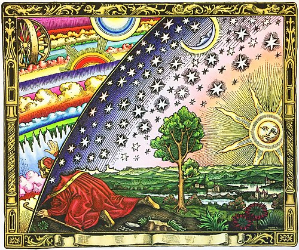

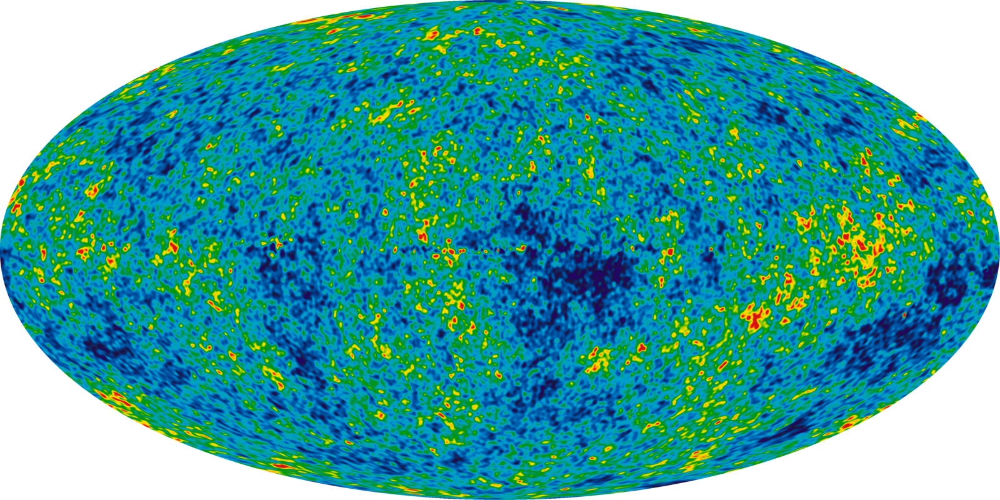

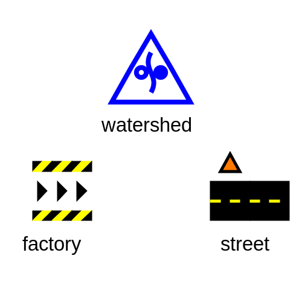

Dictionary definition:

The branch of philosophy dealing with the origin and general structure of the universe, with its parts, elements, and laws, and especially with such of its characteristics as space, time, causality, and freedom.

This definition goes back to before the current era dominated by the mathematical physical sciences.  "Universe" is left pretty open here, and let's dig into a dictionary definition for that:

1. The totality of known or supposed objects and phenomena throughout space; the cosmos; macrocosm.
2. The whole world, especially with reference to humanity: a truth known throughout the universe.
3. A world or sphere in which something exists or prevails: his private universe.
4. Also called universe of discourse. Logic. the aggregate of all the objects, attributes, and relations assumed or implied in a given discussion.
5. Also called universal set. Mathematics. the set of all elements under discussion for a given problem.
6. Statistics. the entire population under study.

In this work, we plan to seize back the word "cosmology" from the branch of astrophysics dealing with specific mathematical studies of the physical universe.  Instead, we use cosmology to refer to the study of the structure of our universe as *we actually interact with it, via our minds, our bodies, and communication with eachother*.  The purpose of this section is to declare that we as thinking people have that right: to define a world view that actually relates to our experience, rather than one that is only relevant for interpreting some obscure data on a black hole or the movement of distant stars. 

So "cosmology" is what we'll use to describe the description of the Universe.  And "Universe" is what we'll use to describe the totality of information flowing into our minds, from senses, internal thoughts, and external thoughts from other people. 

Before defining a new cosmology I want to state what I believe is the current dominant cosmology.  Physicists and many academics would have us believe that the dominant cosmology is the field of astrophysics which studies the shape of the physical universe at the highest length and time scales.  I challenge this--almost none of us understand those models, and even fewer of us really interact with them in a meaningful way in our day to day lives, even professional physicists. 

The true dominant cosmology of our age is the numbers-based world view.  This underlying basis, the idea that numbers have the most fundamental reality, underlies both the cosmology claimed by the astrophysicists and numerous other ideologies.  At the day to day social level, the dominant ideology for the whole world today is some form of capitalism.  At its heart what this really is is the assigning of numbers as value to all things.  We use numbers for prices, numbers for wages, numbers for wealth which measures power, numbers for voting to decide policy, numbers for physics, numbers for data "science" etc. So to build a truly new cosmology is to diverge from this numbers-first world view, and that is what we will do in this work.  

The dominant cosmology has many threads and branches, but if I were to boil it down to *one* thing, it would be just numbers as the basis for everything.  This is the most fundamental level, but if we look at how people actually behave, what we find is that there are very different cosmologies held by the elite in our current system and the masses.  The elite, the technocrats, believe in numbers to a religious degree.  A great number of the masses also claim to believe this but lack the depth of understanding to follow the actual details and really just believe in the technocratic priesthood as faith in the people, rather than in the actual content of the belief system.  Another large fraction of the population does not subscribe to this cosmology and claims to believe a variety of alternatives, often supposedly derived from religion, with a mix of science.  If we look closely at how people actually behave, however, their real cosmology is often driven by mass media and institutions: certain news outlets, consumer culture, certain "culture war" hot topics of interest to their religious leaders, and a very symbol-drive form of blind patriotism.  

It is important to look with clear eyes at what it means in today's society to have a world view.  People pretend their world view is based on some mix of science and religion, but from a practical standpoint this is clearly false.  People in modern America are generally unfamiliar with the contents of both biblical scripture and science.  Rather, the way people see the world is based on flags, dollars, houses, cars, attractive people on tv, insecurities, and a whole host of weird cultural beliefs which make for something much closer to the paganism of ancient Rome than either an informed faith in Christianity or a science-based world view.

If we admit that our world views are mostly a combination of media creations jumbled together to control our behavior, we can declare our freedom to build new world views with very little restrictions.  It is clear that a functioning world view need not be "true" in some absolute sense as that is in general not accessible to our minds. What we want above all else from a world view is *results*.  We want to declare what is best in life and then build a world view which allows us to live lives that tend toward that ideal.  In Geometron we declare that to be caring for others and having adventures.  
   
Another summary of existing cosmology is that it centers on the following main concepts:

- corporations
- nations
- money
- property
- Great Men

Most other things people claim to have as their world view boil down to these main elements.  Take religion and science as examples.  In modern religion, people don't even notice how weird it is historically that all religions are corporations, and are generally defined by that corporate structure. They have revenue, property, money, accounting, etc. just like any other corporation. And the things religions generally care about and preach are directed to peoples relationship with the nation state: laws, above all else.  Religions that ran their own affairs for hundreds of years with limited use of money or and a hands off relationship or even independence from nations now consider the nation-state to the the primary means by which they express their values.  And of course religions of today are dominated by the Great Man theory of history. We take this for granted but this is a fairly new phenomenon.  Religions of numerous people whose cultures developed outside the modern military industrial order exist without famous people who define it.  They have gods, stories, traditions and living people who have special importance, but no Great Men whose names echo through the millennia.  And even the major religions of today in pre-modern times did not have the structures of today: corporations, money and property.

We can analyze modern science with the same point of view.  Modern science is infected with some of the most corrosive Great Man Theory, arguably the worst that exists in society at large.  As scientists we work either for corporations with support of nation-states or directly for nation states, usually in support of the corporate system.  Our creations are defined as "intellectual property". Money and how it flows through our system determines everything about how we work. In much simpler and more obvious ways, our whole lives as scientists are completely defined by money, property, nation-states, and corporations.  

In both the case of modern religion and modern science it is important to observe how far the manifestation of these things are in the existing cosmology is from what they both claim for themselves.  In both cases, they claim to put forth a cosmology and billions of people claim to hold to those cosmologies.  And yet for the most part neither group is very concerned with what they claim their cosmologies are in day to day life.  Whatever random bits of law religious conservatives choose to claim to care about, what we find in practice is that their concerns are not with the content of scripture but with how nation states respond to these things--they are concerned with very earthly power.  The same is true of scientists, who claim a cosmology that is based on the shape of the Universe and what particles matter is made of and yet live in a day to day existence in which these thing matter not at all.  

To boil down the view I'm taking here to one thing, we will say this:

**Language is how the mind parses reality.**

That is, as powerful as our minds, are and our senses, the development of language has so shaped our our minds work, that the very fabric of reality is filtered through it. Thus to manipulate language is to, effectively, manipulate reality itself.  Furthermore, we make the following observations as being so fundamental as to be axiomatic:

1. Everything is physical
2. Everything is fractal
3. Everything is recursive

These axioms diverge our reality from that of the numbers-based cosmology immediately.  More on this must be added.

Thus having seized "cosmology" back from that most reductionist of sciences, physics, and having forked our cosmology from the numbers based world view to one based on language, we can now set about using this to build up a set of linguistic constructs which create an entire self-consistent world view.  This is something that people used to take for granted: people lived with a cosmology that included culture, religion, science, technology, trade, and so on, all of which was woven into a whole system.  Now we live as atomized minds, pretending to "share a world view" that taken as a whole none of us even remotely come close to pretending to understand.  

In this work we strive to build a cosmology which one person can fully understand and hence can use to build and live a good life.  That should be the point of all creation of thought tools: to build better lives. 

Also, cosmology can be specific to a situation, it can be temporary and it can be fictional.  We speak casually all the time of things like "The Star Wars Universe" or "The Marvel Universe" and we all know what these phrases mean even though we do not literally believe them to be "real".  What is real? Is it real if you literally see a real person called Luke Skywalker? or is it enough to say that it is real to know that knowing things about Luke Skywalker can be relevant to your life because you can communicate with other people about it.  

Roughly, the world view sketched here divides our Universe into three parts, joined by a linguistic framework.  Those three parts are the Watershed, the Street, and the Factory.  The linguistic framework is the system of "organic media" documented here, which is a combination of web-based media and physical media, both of which are self-replicating in that each bit of media can be totally replicated by anyone any time anywhere, for free, an infinite number of times(like living things, hence "organic"). 

Our cosmology also centers on our social groups, in the case of this work, the Geometron team or camp or tribe or party.

## Teacher Action:

go through slide deck for this section

## student action:

read this section

Having stated that cosmology is flexible and that it can be a deliberate choice, we can now proceed to make that deliberate choice based on how we actually want to live. To that end we replace the list above with the following list of elements that make up our cosmology:

- The Watershed: how water flows through our physical world 
- The Street: how people and things flow through our physical world
- The Factory: how objects in our physical world are transformed to create utility for us
- Symbols: the symbols that make up the structure of the language we use
- The path: the series of decisions we make to deliberately shape the path of our lives

Basing our cosmology on these things can replace the dominant cosmology.  This does not deny the existence of other things, any more than the dominant cosmology denies the existence of the things listed here(all of which are simply ordinary things in the dominant world view).  Rather, what we are shifting is how we *choose* to think about things *first*.  What is the most fundamental thing?  Again, we note that most modern people will simply speak untruthfully when asked this question.  They will point to either astrophysics, particle physics, or creation stories in scripture while really seeing all these things *primarily* through a lens of corporations, nations, Great Men, money and property.  We simply choose to think another way.  We are not changing what we believe per se, but *how we organize* the information we believe in.  

## [link up a level../](../)

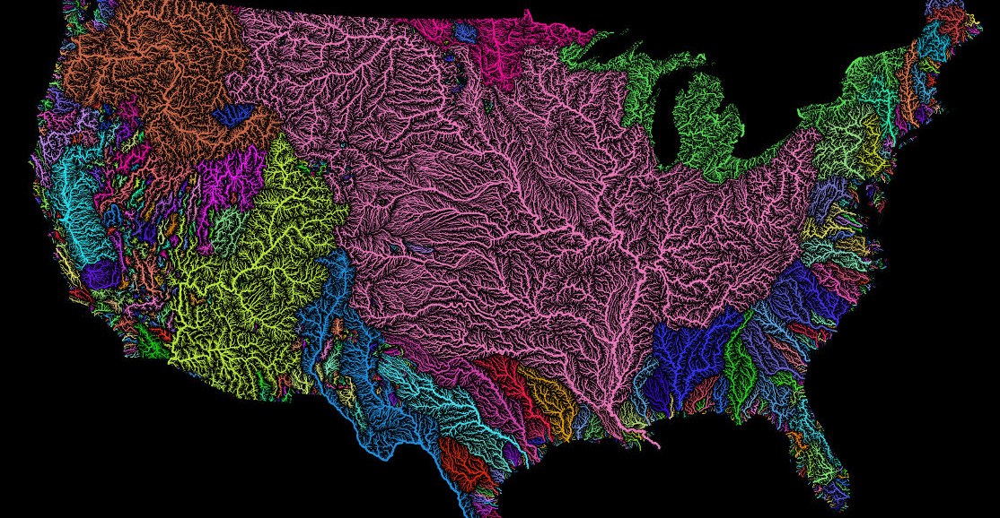

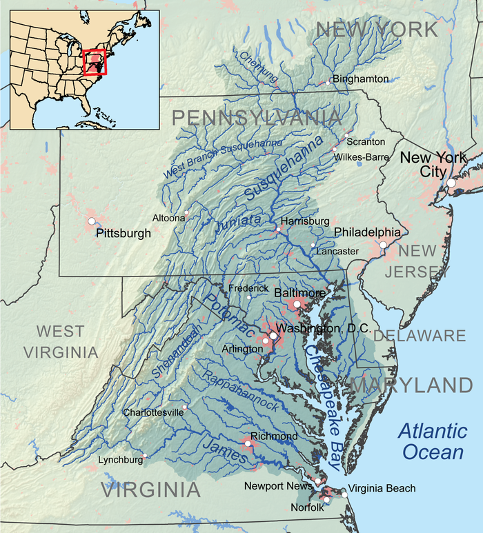

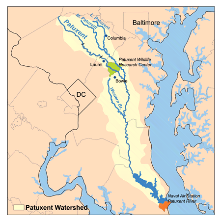

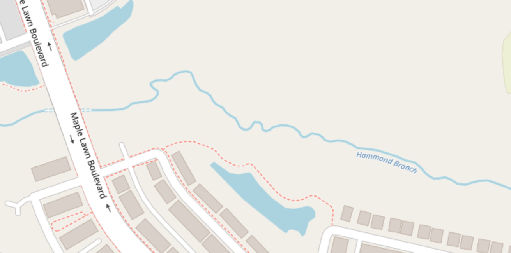

# Watershed

Having declared our intent to construct a cosmology based on how we want to live rather than on reductionist science, we must now choose where to start.  We begin with how life begins, began and continues: with water.  The watershed is the most fundamental component of our world, in a very literal physical sense, but also in other ways. Water binds us to other living things including each other.  Most of our bodies are made up of water, as well as most living things.  If we try to build a new civilization from scratch the first thing we must do is treat clean water for drinking and waste water for safe disposal and reclamation.

Watersheds are already real, they are already studied, and are already part of our lives.  Watersheds are fractal, much like political bodies, and it is an intent of our philosophy to slowly replace existing political bodies with watersheds in importance.  In our political lives, the fractal structure goes from nation to state or province to county, city, and then smaller divisions that are not generally part of law like blocks and streets.  In the watershed, we start with the ocean which our water drains to(or with the sky from which it falls if we reverse direction of scale propagation.)  We then go to sections of the ocean, e.g. from Atlantic to North Atlantic, then to large bays or gulfs like the Chesapeake Bay.  From there there is usually a major river, like the Patuxent River where this book was written. Generally there is at least one but often several layers of fork from that to the smallest creek, stream or drainage ditch.  For this work, I'm in the Hammond Branch watershed in Little Patuxent, in Patuxent, then Chesapeake, then North Atlantic, then Atlantic.  

Other elements of the watershed are the human artifacts we use to interact with water, such as sinks, toilets, showers, baths, pools, sewers, aqueducts, reservoirs, water treatment plants, water towers, fire hydrants, water mains, water pumps, purifiers and filters, desalination plants, rain collectors, etc.  

What do we do with all this information?  First we learn it.  We build up media about our watershed, just tracing what exists in our own lives, become familiar with what knowledge already exists in society about, it. Then, we build up more information on the watershed we interact with and share that: messages for others in the same watershed, scientific data, shared observations, research, and more and more links between connected parts of the real network of watershed elements(such as streams the feed into one another, bridges on the same stream).  Finally, we teach others how to do this, so that the network of information spreads.  This will be a little bit like a crowd sourced global atlas of all things relating to water: not things like "the wikipedia page on water towers" but things like "the water tower in the middle of Maple Lawn Maryland, along MD route 216 near the park n ride".  

The network consists of both online media and physical media.  Physical media generally consists of objects which can be left outside in the weather which communicate how a place or thing fits into the global atlas of watershed elements via urls or names or symbols or some combination.  The online component is a self-replciating media system, to be more thoroughly documented in a future section, which can be hosted on any web server on the Internet.  Self=replicating means you replicate the pages your "self".  That is, anyone familiar with basic operation of the Watershed network is also familiar with how to teach a new person to replicate it, and this is simple enough that non experts can easily learn it and do it.  Each web page in the Network also is a fractal: it can be forked down to an arbitrary number of sub-layers of heiearchy.  

Each new instance of this book will document the local watershed as it exists where the book was edited.  In this case the local watershed is the Hammond Branch, a very small stream that wildly fluctuates in flow with the weather.  In heavy rains it looks like a river.  When it hasn't rained for a few days it looks like barely a stream. Hammond Branch empties into the Little Patuxent, downstream of where it is joined by the Middle Patuxent, then the combined Little Patuxent eventually empties into the main Patuxent river, where it meanders down to empty into Chesapeake bay just a little bit north of the mouth of the Potomac River.  Chesapeake bay then empties out into the West side of the North Atlantic ocean.

Where does water come from? where does it go?  how much?  what is the rainfall?  what are the prevailing winds that determine where the clouds come from?  Where do the clouds form? 

This is the symbol for the Watershed network, created by the Geometron language documented later:

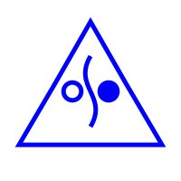

The blue color represents water.  The triangle represents the geometric order of the Universe.  The open circle represents the water coming down from the sky, the filled circle represents the sea to which all water flows, and the curved line represents the flowing waterways like rivers and streams.

## Teacher Action:

The teacher will build out some local nodes in the Watershed network for the physical location where the student is or where we are together sharing this information.  This can be a sub-page of some other existing Watershed network page, it does not need its own domain, but it does need for someone to go ahead and make a new node, and make a marker which points to that specific node, with information on how to get there from the top level domain.  Teacher will put a physical marker in a physical place in the Watershed network and guide 

## Student action

Go with teacher out into the physical world see the physical marker, put that into your mobile device, navigate the network from there, physically.  Make a sub page to some existing node on that part of the network, make a marker and plant it in the place of your new node.

## [link up a level../](../)

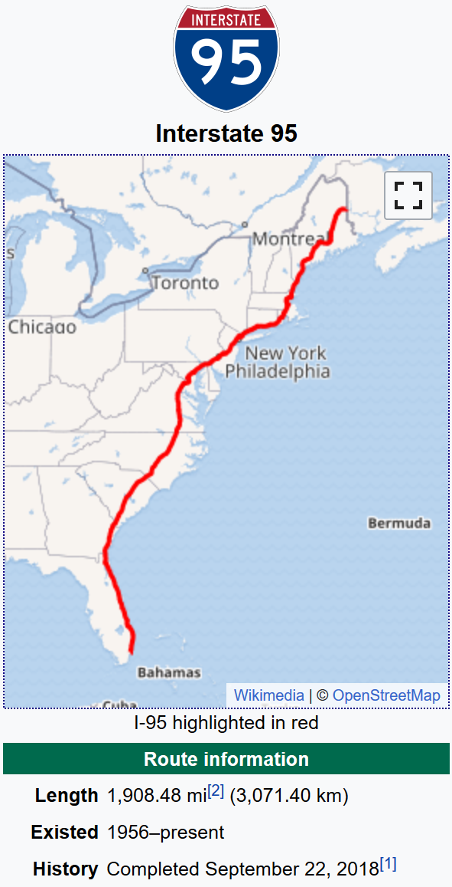

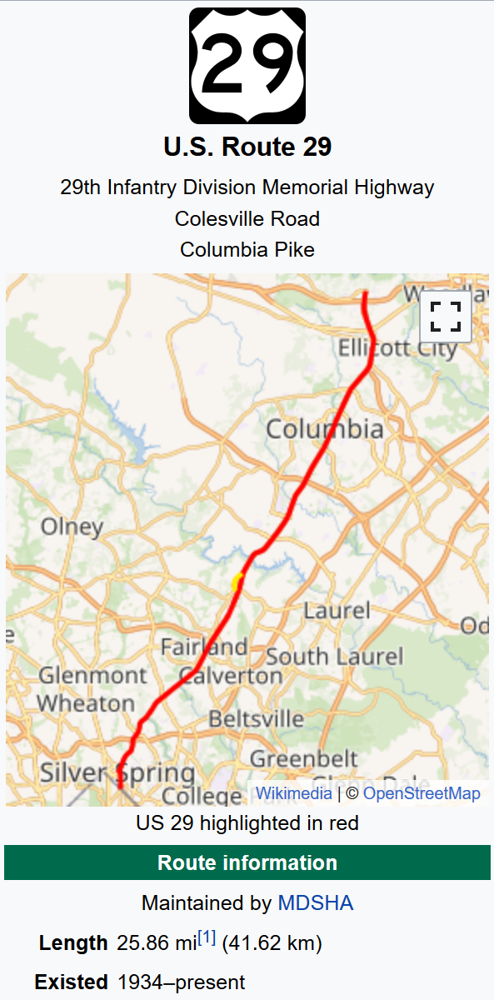

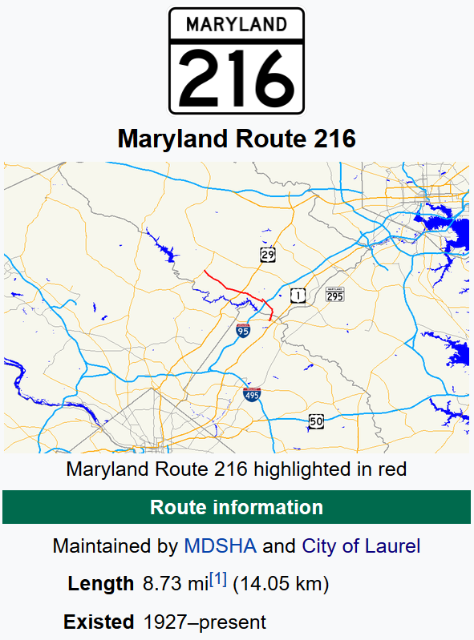

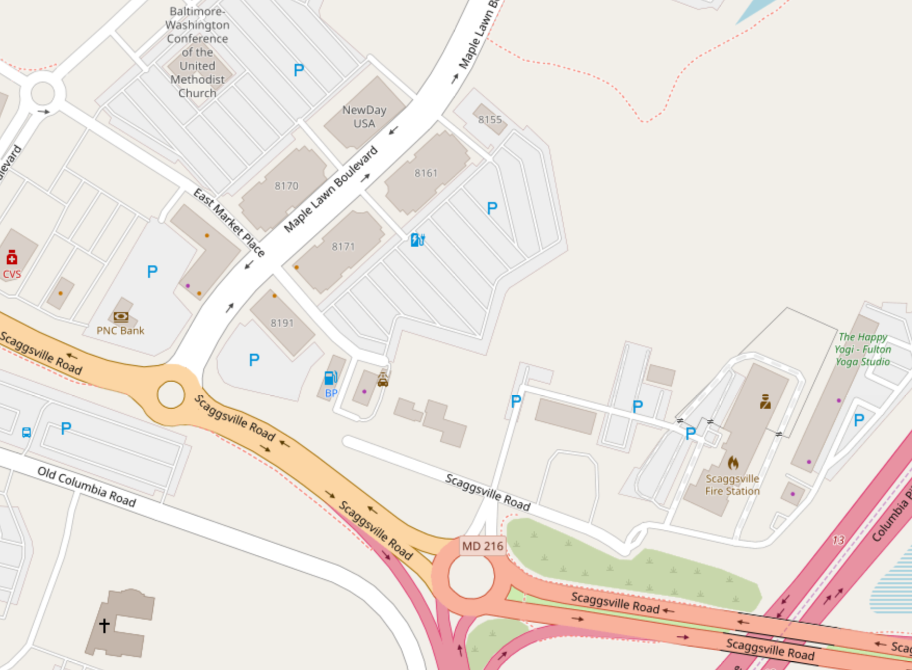

# street

The Street is the next layer of cosmology above Watershed.  The Street is a broad term in our cosmology for street-like structures that define our environment in terms of how people and goods move around.  This, like Watershed, is a fractal.  For instance the Interstate 95 corridor on the East Coast or Interstate 5 Corridor on the West coast are as much real things which determine the nature of our reality as our local river or ocean.  Below major transit corridors are next level highways, some of which are beltways or interstates or major state and federal routes.  Then there are local major roads, local minor roads, then the concrete or other building structures directly around wherever we are, which might be sidewalks, parking lots, benches, areas of some local park, a shopping center, etc.

As with the Watershed, of course the Street as defined here already exists.  What we are doing here is refocusing on it as a separate entity from political or business structures--we are focusing on the actual physical things, not what their current meaning is in our existing system.  Also we are building a network of Street elements, where each element maps to a web page, and also physical media which point to web pages.  Again, we are building a self-replicating network where we build elements in our direct environment, then teach others to do the same, and spread the network out to the whole world. 

What is the Street where this book comes from?  At the top level, the Interstate 95 corridor defines where I am while I write this.  From there, the main local artery is the local also north-south route US Route 29.  At the most local level a very short easy walk from where most of this work is done is Maryland Route 216 a very local road.  Below that are various suburban shopping centers that define the physical commercial life where food and goods flow through this place.  This includes Sidamo Coffee, CVS pharmacy, Harris Teeter groceries, the shop at the BP gas station, and the Cherry Tree shopping center. 

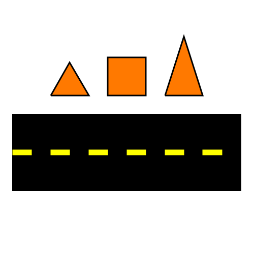

## Teacher Action:

The teacher will build out some local nodes in the Street network for the physical location where the student is or where we are together sharing this information.  This can be a sub-page of some other existing Watershed network page, it does not need its own domain, but it does need for someone to go ahead and make a new node, and make a marker which points to that specific node, with information on how to get there from the top level domain.  Teacher will put a physical marker in a physical place in the Street network and guide 

## Student action

Go with teacher out into the physical world see the physical marker, put that into your mobile device, navigate the network from there, physically.  Make a sub page to some existing node on that part of the network, make a marker and plant it in the place of your new node.

## [Up a level](../)

# Factory

The factory is the information structure of production of useful goods and services.  In the world of global information networks, buildings with machines in them are no longer really the "means of production".  Rather, the means of production are the information structures which define the flows of information, energy, materials, and labor which create value.  This might very well be a building filled with machines that are used to fabricate things, in the conventional sense of the word "factory" but in general it is going to be something much more ephemeral.   

The "factory" in our cosmology is media-first.  That is, it is primarily defined by the media which documents it.  That media is, like all media in our system, self-replicating.  Thus a factory is really a self-replicating system for making things.  The first things we'll deploy in this system will be more media: self-replicating media which makes more media.  First is the digital media, and then the physical media, which define markers, signs, cards, maps, books etc. which point to various bits of digital media.  Then the next level up from that is practical objects which serve some function like shelter, storage, furniture or simple machines, and we'll build media which fully document the endless replication of those things.  In this work we will then point to the ultimate goal of such factories, which is industrial machines which can make a wide range of useful products.  If you can create self-replicating digital media which replicates self-replicating physical media, which combines to replicate machines which can create a flow of value, that can totally change the world. 

One thing a sustainable cosmology needs is a way to exist in the world as we find it today as well as a path to exist in the world as it will exist after the coming intersecting crises of the current world accelerate.  To this end, we need to build industrial production which can generate revenue with almost no up front cost at all in the existing economic system, and which also create objects which are of intrinsic value independent of the money system.  To both of these ends, what we need are machines which can be built using entirely materials bought cheaply online and donated by others in the network which take as feedstock "trash" of one kind or another and produce things of intrinsic value.  In this work we will present a couple of these, and will attempt to document them in enough detail that readers can replicate the entire thing and immediately start to sell things and make money, then use that money to spread the network by buying more infrastucture and training others.  Note that for this to propagate it does not need to make a *lot* of money or be *very* useful.  It just has to have the right sign: each stage as it propagates has to make more money and be more useful and engage more people than the one before it.  As with life, organic media either grows or dies and if it grows at all, the power of the exponential can truly shake the Universe in a short time.

This is the symbol of the factory:

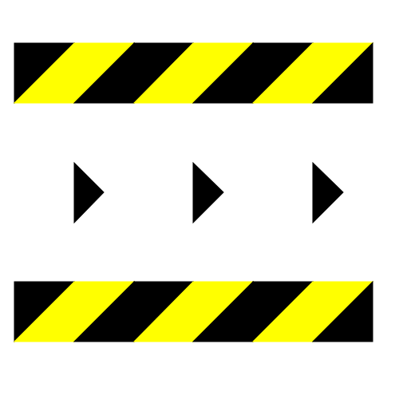

The Factory concept can be thought of as having several primary directions to consider.  First of all, the factory is just the flow of new elements made in the various sections of this book, the things we can make *right now*.  Second of all, there are the things we want to make for money as we grow the system in ways that are self-sustaining.  And finally there are the end goals of this work, which is to build a "technological complete set".  A technological complete set is a collection of technologies from which all human needs can be derived.  That doesn't mean the technology necessarily does all the things we need, it means that it has all the elements from which all needed technology *can be derived or evolved*.  Obviously this is a tall order, and it is a long term goal, although I will address it in later sections of this work.  

Thus we use the factory to describe three very different stages of technological maturity.  The first of these, the things which are only needed to replicate this work, each reader will individually fully replicate, and should be able to spread extremely rapidly as a mass media phenomenon.  The second type of factory, the one used to make money teaching this system, will be based on a deep study of the first set of skills and technologies, and the full ability to change it at its deepest level.  To provide a large amount of added value, the people operating factories at this level will really be selling the ability to teach others to hack the system at the deepest level, altering all components: code, physical media, digital media, and underlying structure.  

The final layer of technology, building the complete set of technology will be an intense research and development effort of many people, one of the greatest technological quests in history, as our goal will be to build a truly sustainable technological culture which can survive the coming collapse.  In order to have the resources needed to carry out this research task, the second layer of technology must be profitable enough, in a totally decentralized way, to support a vast decentralized network of intense R&D. This means we must build the *equivalent* of a multi billion dollar company.  If we imagine this as a network with hundreds of thousands of nodes each with millions of dollars of yearly cash flow, with a few dozen people. Or millions of nodes with a few hundred thousand dollars yearly cash flow.

The Factory thus has many layers, and what ends up being made by the teacher and student will depend enormously on context and will evolve a great deal as this project evolves and grows.  In many cases, this section will be very different for different students, as well, depending on context.  In some cases, the entire project of teaching the system will come down to this: the factory is a thing of extremely high value which the teacher is imparting to the student.  

Some of the "products" which Geometron factories will produce are:

- web pages
- books
- web calculators 
- custom apps
- Geographical app/pages
- memes
- geographic maps with links on them
- markers, cards,signs and other physical link media
- plotter robots that can create physical media with automation
- products of those robots
- custom specialty motors 
- custom domain names with Geometron network on them
- local web server running on a raspberry pi
- symbols
- custom symbolic languages of various kinds
- organic media based brand creation as service
- brand language as service
- custom fonts and graphical languages
- custom symbolic keyboards for custom languages
- geometric constructions from sticks and string; furniture
- cardboard and tape constructions: purses, storage, carrying cases
- geometry tools and shapes: plastic, laminated paper, etc.

## Some images to add:

- flow diagram of a book factory
- photograph of a book factory

## Teacher Action

figure out what your team can and wants to build.  discuss with them what they want to build, help them brainstorm things they can build, how they might turn that into value both in terms of making money and in terms of post money values.

## student action

figure out what kinds of factories you want to build.  Figure out what factories you are participating now: how can you view the goods and services you provide for money or pay for as self-replicating information structures.  how do the factories you participate in replicate?  What do you *want* to make?

## [up a level](../)

# Path, ὁδός, 道

The Path, or the Way, is a fundamental element of any cosmology.  It links this to numerous existing philosophical and religious frameworks, in which the basic shared belief system of a group of people is defined by what we *do*, how we *live*, the path we walk as we go through life.  

This may seem trivial, and it's generally ignored in modern science, but this is one of the things that makes our current system of science so broken.  In the scientific world view a cosmological theory just stands alone as a sterile collection of mathematical relations, independent of the people who made the theory, who use it, or whose lives might be affected by it.  Indeed the theory is generally not even judged on who can understand or interact with it.  Theories have something called "truth", and if we believe the truth is greater than other theories, that is more important than how many people can understand it or what benefit there is for those who do understand it.  

The Path we walk will be how we come together as people to live in a shared Universe in a Watershed, connected to Streets, and building useful things in Factories.  The word "way" references the word used in numerous Asian languages which is spelled "dao" in Mandarin, or "do" in Japanese and Korean.  The word "Path" was used by the early Christians to describe their fellowship, and so this combined idea of path/way has strong resonances both in the Christian world and in the East.  Also, "Path" implies a linking of points in a space, which is a useful way of thinking of a way of life.  Life can be thought of as a sequence of actions we take as we traverse through space and time.  This sequence forms a path in the Universe of potential actions.

There are numerous Paths which will be constructed by those who read this book and its offshoots. Rather than dwell too much on specifics, this section merely describes how important this is as a concept and lets the reader imagine, describe and share their own vision.  This might be religious or secular, vague or specific, strict or liberal, but what matters is that we think about it and then declare and share it.  Only be declaring a path, sharing it, and propagating it, can we create the rapid evolution required to make *better* paths.  I do not claim to have the best path or even be anywhere near a best path. I merely want to convince the reader that *a* path is worthwhile.  

One way or another, it is the path, or the fundamental way of life that we have to change if we will survive as a species. This has to go together with building a new cosmology but is not really the same thing: a cosmology defines how we see our world, and the path defines how we live in that world.  In today's world our paths are largely unexamined
and divorced from our mechanistic cosmologies that are so abstract as to have little impact on our day to day lives.  Many people in modern society therefore turn to ancient cosmologies, various old religious beliefs, and strive to follow a path of living that is in line with that cosmology.  This has a tendency to be very superficial, however, as using an ancient cosmology in a modern society means having a cosmology that has very little to say about much of the structure of technological society which simply did not exist when their world views were being formed.  People who walk this path cling to very specific pet issues, but keep driving cars to work at pointless jobs, and buying the same consumer products as everyone else.  They keep supporting governments and companies that pursue policies that are leading us all to extinction.  

If we want to get off these paths, we must create cosmologies that reflect realities of the modern world, and then rebuild our whole ways of living up inside those cosmologies and modify both as we go based on what works or what does not work.  This is what the ancient people did to build the older world views people still cling to and it is what we must do now.

## Teacher Action:

Present and describe how you live the Path of Geometron, how it fits into your life.  Learn from your students what their paths are now: what do they believe, how do they lives their lives, how do they want to make that better, how do they want to live?

## Student Action:

Listen, learn and discuss how Geometron might fit into your life in ways that might alter its path.  Articulate your path: what do you believe, how does that impact how you live? how might you change how you live to be more in line with a geometron cosmology?

 