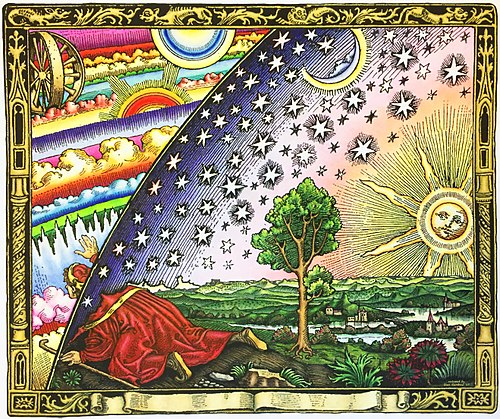

# [link up a level../](../)

# Cosmology

Dictionary definition:

The branch of philosophy dealing with the origin and general structure of the universe, with its parts, elements, and laws, and especially with such of its characteristics as space, time, causality, and freedom.

This definition goes back to before the current era dominated by the mathematical physical sciences.  "Universe" is left pretty open here, and let's dig into a dictionary definition for that:

1. The totality of known or supposed objects and phenomena throughout space; the cosmos; macrocosm.
2. The whole world, especially with reference to humanity: a truth known throughout the universe.
3. A world or sphere in which something exists or prevails: his private universe.
4. Also called universe of discourse. Logic. the aggregate of all the objects, attributes, and relations assumed or implied in a given discussion.
5. Also called universal set. Mathematics. the set of all elements under discussion for a given problem.
6. Statistics. the entire population under study.

In this work, we plan to seize back the word "cosmology" from the branch of astrophysics dealing with specific mathematical studies of the physical universe.  Instead, we use cosmology to refer to the study of the structure of our universe as *we actually interact with it, via our minds, our bodies, and communication with eachother*.  The purpose of this section is to declare that we as thinking people have that right: to define a world view that actually relates to our experience, rather than one that is only relevant for interpreting some obscure data on a black hole or the movement of distant stars. 

So "cosmology" is what we'll use to describe the description of the Universe.  And "Universe" is what we'll use to describe the totality of information flowing into our minds, from senses, internal thoughts, and external thoughts from other people. 

Before defining a new cosmology I want to state what I believe is the current dominant cosmology.  Physicists and many academics would have us believe that the dominant cosmology is the field of astrophysics which studies the shape of the physical universe at the highest length and time scales.  I challenge this--almost none of us understand those models, and even fewer of us really interact with them in a meaningful way in our day to day lives, even professional physicists. 

The true dominant cosmology of our age is the numbers-based world view.  This underlying basis, the idea that numbers have the most fundamental reality, underlies both the cosmology claimed by the astrophysicists and numerous other ideologies.  At the day to day social level, the dominant ideology for the whole world today is some form of capitalism.  At its heart what this really is is the assigning of numbers as value to all things.  We use numbers for prices, numbers for wages, numbers for wealth which measures power, numbers for voting to decide policy, numbers for physics, numbers for data "science" etc. So to build a truly new cosmology is to diverge from this numbers-first world view, and that is what we will do in this work.  

The dominant cosmology has many threads and branches, but if I were to boil it down to *one* thing, it would be just numbers as the basis for everything.  This is the most fundamental level, but if we look at how people actually behave, what we find is that there are very different cosmologies held by the elite in our current system and the masses.  The elite, the technocrats, believe in numbers to a religious degree.  A great number of the masses also claim to believe this but lack the depth of understanding to follow the actual details and really just believe in the technocratic priesthood as faith in the people, rather than in the actual content of the belief system.  Another large fraction of the population does not subscribe to this cosmology and claims to believe a variety of alternatives, often supposedly derived from religion, with a mix of science.  If we look closely at how people actually behave, however, their real cosmology is often driven by mass media and institutions: certain news outlets, consumer culture, certain "culture war" hot topics of interest to their religious leaders, and a very symbol-drive form of blind patriotism.  

It is important to look with clear eyes at what it means in today's society to have a world view.  People pretend their world view is based on some mix of science and religion, but from a practical standpoint this is clearly false.  People in modern America are generally unfamiliar with the contents of both biblical scripture and science.  Rather, the way people see the world is based on flags, dollars, houses, cars, attractive people on tv, insecurities, and a whole host of weird cultural beliefs which make for something much closer to the paganism of ancient Rome than either an informed faith in Christianity or a science-based world view.

If we admit that our world views are mostly a combination of media creations jumbled together to control our behavior, we can declare our freedom to build new world views with very little restrictions.  It is clear that a functioning world view need not be "true" in some absolute sense as that is in general not accessible to our minds. What we want above all else from a world view is *results*.  We want to declare what is best in life and then build a world view which allows us to live lives that tend toward that ideal.  In Geometron we declare that to be caring for others and having adventures.  
   

To boil down the view I'm taking here to one thing, we will say this:

**Language is how the mind parses reality.**

That is, as powerful as our minds, are and our senses, the development of language has so shaped our our minds work, that the very fabric of reality is filtered through it. Thus to manipulate language is to, effectively, manipulate reality itself.  Furthermore, we make the following observations as being so fundamental as to be axiomatic:

1. Everything is physical
2. Everything is fractal
3. Everything is recursive

These axioms diverge our reality from that of the numbers-based cosmology immediately.  More on this must be added.

Thus having seized "cosmology" back from that most reductionist of sciences, physics, and having forked our cosmology from the numbers based world view to one based on language, we can now set about using this to build up a set of linguistic constructs which create an entire self-consistent world view.  This is something that people used to take for granted: people lived with a cosmology that included culture, religion, science, technology, trade, and so on, all of which was woven into a whole system.  Now we live as atomized minds, pretending to "share a world view" that taken as a whole none of us even remotely come close to pretending to understand.  

In this work we strive to build a cosmology which one person can fully understand and hence can use to build and live a good life.  That should be the point of all creation of thought tools: to build better lives. 

Also, cosmology can be specific to a situation, it can be temporary and it can be fictional.  We speak casually all the time of things like "The Star Wars Universe" or "The Marvel Universe" and we all know what these phrases mean even though we do not literally believe them to be "real".  What is real? Is it real if you literally see a real person called Luke Skywalker? or is it enough to say that it is real to know that knowing things about Luke Skywalker can be relevant to your life because you can communicate with other people about it.  

Roughly, the world view sketched here divides our Universe into three parts, joined by a linguistic framework.  Those three parts are the Watershed, the Street, and the Factory.  The linguistic framework is the system of "organic media" documented here, which is a combination of web-based media and physical media, both of which are self-replicating in that each bit of media can be totally replicated by anyone any time anywhere, for free, an infinite number of times(like living things, hence "organic"). 

Our cosmology also centers on our social groups, in the case of this work, the Geometron team or camp or tribe or party.

## Teacher Action:

go through slide deck for this section

## student action:

read this section

 