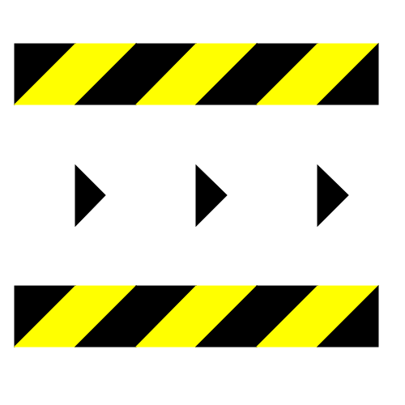

## [Up a level](../)

# Factory

The factory is the information structure of production of useful goods and services.  In the world of global information networks, buildings with machines in them are no longer really the "means of production".  Rather, the means of production are the information structures which define the flows of information, energy, materials, and labor which create value.  This might very well be a building filled with machines that are used to fabricate things, in the conventional sense of the word "factory" but in general it is going to be something much more ephemeral.   

The "factory" in our cosmology is media-first.  That is, it is primarily defined by the media which documents it.  That media is, like all media in our system, self-replicating.  Thus a factory is really a self-replicating system for making things.  The first things we'll deploy in this system will be more media: self-replicating media which makes more media.  First is the digital media, and then the physical media, which define markers, signs, cards, maps, books etc. which point to various bits of digital media.  Then the next level up from that is practical objects which serve some function like shelter, storage, furniture or simple machines, and we'll build media which fully document the endless replication of those things.  In this work we will then point to the ultimate goal of such factories, which is industrial machines which can make a wide range of useful products.  If you can create self-replicating digital media which replicates self-replicating physical media, which combines to replicate machines which can create a flow of value, that can totally change the world. 

One thing a sustainable cosmology needs is a way to exist in the world as we find it today as well as a path to exist in the world as it will exist after the coming intersecting crises of the current world accelerate.  To this end, we need to build industrial production which can generate revenue with almost no up front cost at all in the existing economic system, and which also create objects which are of intrinsic value independent of the money system.  To both of these ends, what we need are machines which can be built using entirely materials bought cheaply online and donated by others in the network which take as feedstock "trash" of one kind or another and produce things of intrinsic value.  In this work we will present a couple of these, and will attempt to document them in enough detail that readers can replicate the entire thing and immediately start to sell things and make money, then use that money to spread the network by buying more infrastucture and training others.  Note that for this to propagate it does not need to make a *lot* of money or be *very* useful.  It just has to have the right sign: each stage as it propagates has to make more money and be more useful and engage more people than the one before it.  As with life, organic media either grows or dies and if it grows at all, the power of the exponential can truly shake the Universe in a short time.

This is the symbol of the factory:

The Factory concept can be thought of as having several primary directions to consider.  First of all, the factory is just the flow of new elements made in the various sections of this book, the things we can make *right now*.  Second of all, there are the things we want to make for money as we grow the system in ways that are self-sustaining.  And finally there are the end goals of this work, which is to build a "technological complete set".  A technological complete set is a collection of technologies from which all human needs can be derived.  That doesn't mean the technology necessarily does all the things we need, it means that it has all the elements from which all needed technology *can be derived or evolved*.  Obviously this is a tall order, and it is a long term goal, although I will address it in later sections of this work.  

Thus we use the factory to describe three very different stages of technological maturity.  The first of these, the things which are only needed to replicate this work, each reader will individually fully replicate, and should be able to spread extremely rapidly as a mass media phenomenon.  The second type of factory, the one used to make money teaching this system, will be based on a deep study of the first set of skills and technologies, and the full ability to change it at its deepest level.  To provide a large amount of added value, the people operating factories at this level will really be selling the ability to teach others to hack the system at the deepest level, altering all components: code, physical media, digital media, and underlying structure.  

The final layer of technology, building the complete set of technology will be an intense research and development effort of many people, one of the greatest technological quests in history, as our goal will be to build a truly sustainable technological culture which can survive the coming collapse.  In order to have the resources needed to carry out this research task, the second layer of technology must be profitable enough, in a totally decentralized way, to support a vast decentralized network of intense R&D. This means we must build the *equivalent* of a multi billion dollar company.  If we imagine this as a network with hundreds of thousands of nodes each with millions of dollars of yearly cash flow, with a few dozen people. Or millions of nodes with a few hundred thousand dollars yearly cash flow.

The Factory thus has many layers, and what ends up being made by the teacher and student will depend enormously on context and will evolve a great deal as this project evolves and grows.  In many cases, this section will be very different for different students, as well, depending on context.  In some cases, the entire project of teaching the system will come down to this: the factory is a thing of extremely high value which the teacher is imparting to the student.  

Some of the "products" which Geometron factories will produce are:

- web pages
- books
- web calculators 
- custom apps
- Geographical app/pages
- memes
- geographic maps with links on them
- markers, cards,signs and other physical link media
- plotter robots that can create physical media with automation
- products of those robots
- custom specialty motors 
- custom domain names with Geometron network on them
- local web server running on a raspberry pi
- symbols
- custom symbolic languages of various kinds
- organic media based brand creation as service
- brand language as service
- custom fonts and graphical languages
- custom symbolic keyboards for custom languages
- geometric constructions from sticks and string; furniture
- cardboard and tape constructions: purses, storage, carrying cases
- geometry tools and shapes: plastic, laminated paper, etc.

## Some images to add:

- flow diagram of a book factory
- photograph of a book factory

## Teacher Action

figure out what your team can and wants to build.  discuss with them what they want to build, help them brainstorm things they can build, how they might turn that into value both in terms of making money and in terms of post money values.

## student action

figure out what kinds of factories you want to build.  Figure out what factories you are participating now: how can you view the goods and services you provide for money or pay for as self-replicating information structures.  how do the factories you participate in replicate?  What do you *want* to make?

