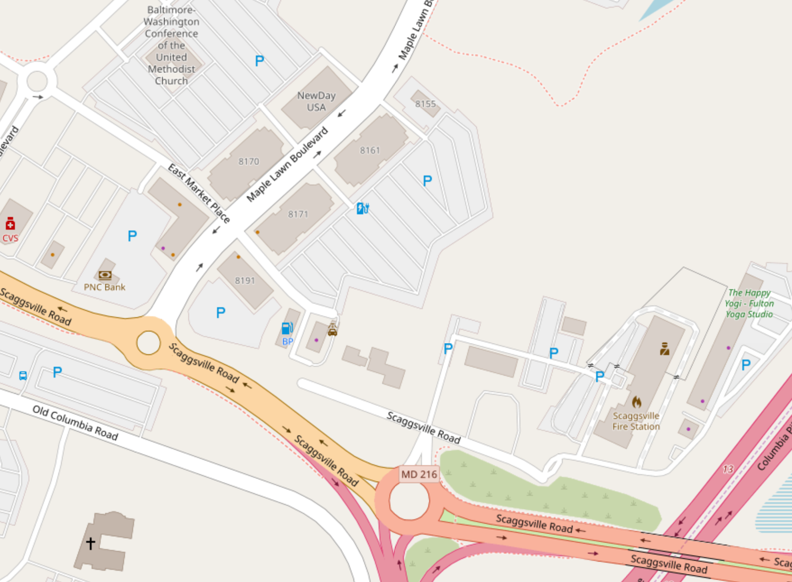
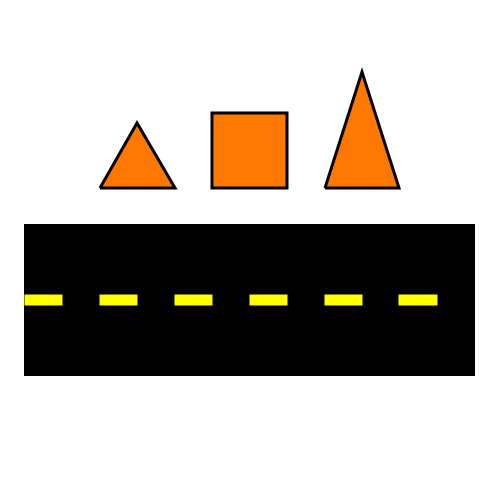

## [link up a level../](../)

# street

The Street is the next layer of cosmology above Watershed.  The Street is a broad term in our cosmology for street-like structures that define our environment in terms of how people and goods move around.  This, like Watershed, is a fractal.  For instance the Interstate 95 corridor on the East Coast or Interstate 5 Corridor on the West coast are as much real things which determine the nature of our reality as our local river or ocean.  Below major transit corridors are next level highways, some of which are beltways or interstates or major state and federal routes.  Then there are local major roads, local minor roads, then the concrete or other building structures directly around wherever we are, which might be sidewalks, parking lots, benches, areas of some local park, a shopping center, etc.

As with the Watershed, of course the Street as defined here already exists.  What we are doing here is refocusing on it as a separate entity from political or business structures--we are focusing on the actual physical things, not what their current meaning is in our existing system.  Also we are building a network of Street elements, where each element maps to a web page, and also physical media which point to web pages.  Again, we are building a self-replicating network where we build elements in our direct environment, then teach others to do the same, and spread the network out to the whole world. 

## Teacher Action:

The teacher will build out some local nodes in the Street network for the physical location where the student is or where we are together sharing this information.  This can be a sub-page of some other existing Watershed network page, it does not need its own domain, but it does need for someone to go ahead and make a new node, and make a marker which points to that specific node, with information on how to get there from the top level domain.  Teacher will put a physical marker in a physical place in the Street network and guide 

## Student action

Go with teacher out into the physical world see the physical marker, put that into your mobile device, navigate the network from there, physically.  Make a sub page to some existing node on that part of the network, make a marker and plant it in the place of your new node.